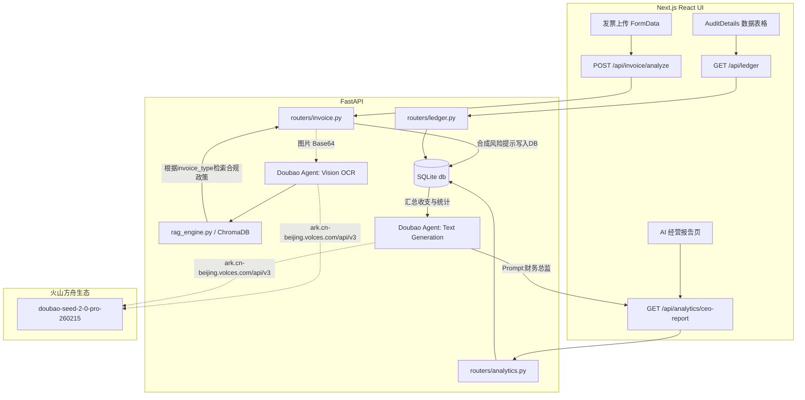

# 智税通 (Zhi Shui Tong) Beta Architecture Plan - 豆包大模型版

## 1. System Overview
系统采用前后端分离架构，专为快速演示与低成本云端部署设计。核心 AI 驱动力已从 Google Gemini 成功切换至字节跳动豆包大模型（通过火山方舟 OpenAI SDK 兼容接口调用），满足国内合规与访问速度需求。

- **Frontend**: Next.js 14+ (React, Tailwind CSS, Zustand, Framer Motion). 负责呈现数据可视化与 7 大高保真交互模块。独立在 `frontend/` 目录运行。
- **Backend**: Python 3.10+ FastAPI. 提供 RESTful API，承载所有核心业务逻辑与 AI 智能体流转。独立在 `backend/` 目录运行。
- **Relational DB**: SQLite. 零配置本地关系型数据库，通过 SQLAlchemy ORM 存储账簿 (`LedgerItem`) 流水。
- **Vector DB**: ChromaDB. 本地向量数据库，负责 `docs/2026_tax_policy.md` 财税政策的 RAG（检索增强生成）本地实例化能力。
- **LLM Engine**: 豆包多模态与文本大模型 (`doubao-seed-2-0-pro-260215`)，用于 OCR 视觉解析与一键生成 CEO 语言的经营报告。

## 2. Directory Structure (当前最新工程化目录)

```text
/zhi-shui-tong-beta
├── frontend/                     # 🌟 前端工程独立目录
│   ├── src/
│   │   ├── app/                  # Next.js App Router 页面组件 (Dashboard, Analytics等)
│   │   ├── components/           # UI 切片库 (InvoiceUploader, AuditDetails, Sidebar等)
│   │   └── lib/
│   │       └── api.ts            # 配置 axios 客户端指向本地 8000 端口 FastAPI 服务
│   ├── package.json
│   └── next.config.mjs
│
├── backend/                      # 🌟 后端工程独立目录
│   ├── app/
│   │   ├── main.py               # FastAPI 启动入口及挂载的 CORS 配置
│   │   ├── core/
│   │   │   ├── config.py         # 基于 pydantic-settings 加载火山方舟环境密钥
│   │   │   └── database.py       # 初始化本地 SQLite 和 ChromaDB 连接引擎
│   │   ├── models/
│   │   │   ├── domain.py         # SQLAlchemy ORM 结构
│   │   │   └── schemas.py        # Pydantic Request/Response 入参出参校验
│   │   ├── routers/
│   │   │   ├── invoice.py        # API: /api/invoice/analyze (多模态上传图片)
│   │   │   ├── ledger.py         # API: /api/ledger (查询入账流水)
│   │   │   └── analytics.py      # API: /api/analytics/ceo-report (AI报告指令)
│   │   └── services/
│   │       ├── doubao_agent.py   # 封装调用 OpenAI SDK 以及豆包提示词配置
│   │       └── rag_engine.py     # 载入并检索 Chroma DB 本地化政策
│   ├── docs/
│   │   └── 2026_tax_policy.md    # 🌟 RAG 知识库基础文档 (启动即刻向量化)
│   └── requirements.txt          # Python 包依赖
```

## 3. Data Flow & Integration (Mermaid)


## 4. 落地三大高感知功能流转机制

1. **动态 Dashboard 与即时落账 (Ledger)**
   - 后端使用 `SQLAlchemy` 重构写入逻辑。当用户在 `InvoiceUploader.tsx` (Dashboard中) 上传票据时，后台首先通过豆包 SDK 解析 OCR，随后将核心元素（如金额，发票号码）硬性持久化到 `/backend/data/zst_database.db` 中。
   - 前端通过 `AuditDetails.tsx` 调用 `GET` 并轮询，页面刷新即呈现最新 SQLite 的真实落账信息。
2. **RAG 政策红绿灯预警体系**
   - 移除写死的警告。系统每次收到解析完的 `invoice_type`（如餐饮费等），立刻前往 ChromaDB 查询 `backend/docs/2026_tax_policy.md`。如果是敏感消费，则在返回值增加 `risk_warning` 并在 UI 显示政策引述。
3. **CEO 级 AI 老板管理简报**
   - 后端 `/api/analytics/ceo-report` 聚合本月 SQLite 数据（笔数与总额），注入豆包文本大模型提示词。左侧导航栏单击 **AI报告** 后，由前端打字机效果输出大模型回复结果。

## 5. UI/UX Architecture (Phase 7 Light Theme Refactoring)

系统已全面完成从“早期暗黑极客风”向“国内企业级现代 SaaS 明亮风格 (Light Theme)”的彻底转型，以满足商业化产品演示的标准质感。

*   **Global Design Token System (`globals.css` & `tailwind.config.ts`)**
    *   通过 CSS 原生变量（如 `--primary`, `--bg-main`, `--text-main` 等）建立起一套健壮的 Light Theme 语义化调色盘，摒弃硬编码色值。
    *   页面底色使用 `#F8FAFC`，信息卡片使用纯白 `#FFFFFF` 配合 `shadow-sm` 带来微浮雕层级感。

*   **Layout & Navigation (`Sidebar.tsx`, `Topbar.tsx`, `page.tsx`)**
    *   `Sidebar.tsx`: 深蓝商务沉底 (#0F172A)，配合品牌蓝 (`#2563EB`) 高亮当前所处业务域。
    *   `Topbar.tsx`: 纯白顶栏，具备随动式面包屑导航，并集合了全局“导出报表 (CSV/PDF/Word)” 下拉拓展操作组件。

*   **Core Pages Component Engineering (`components/screens/`)**
    *   **DashboardScreen (工作台)**: 将复杂的财务流水可视化为按月分布的“收入、支出、净利润”三指标分组动态柱状图。底部动态表单连接远端 SQLite Ledger 实例。
    *   **RiskScreen (风险预警)**: 提取企业综合税务健康分等关键指标用彩色高亮大字强化，下方采用图文卡片式展现 RAG 命中政策的解读规则。
    *   **AnalyticsScreen (经营分析)**: 将原先单调的长文替换入流光质感的提示外框，配上结构化的收入分配刻度图和老板专用周报打字机流式呈现 (Streaming text simulation)。
    *   **SettingsScreen (系统设置)**: 补充标准的两栏布局参数设定后台。
    *   **InvoiceScreen & LedgerScreen & WorkflowScreen**: 使用现代化留白处理审批单和拖拽上传文件交互控件。